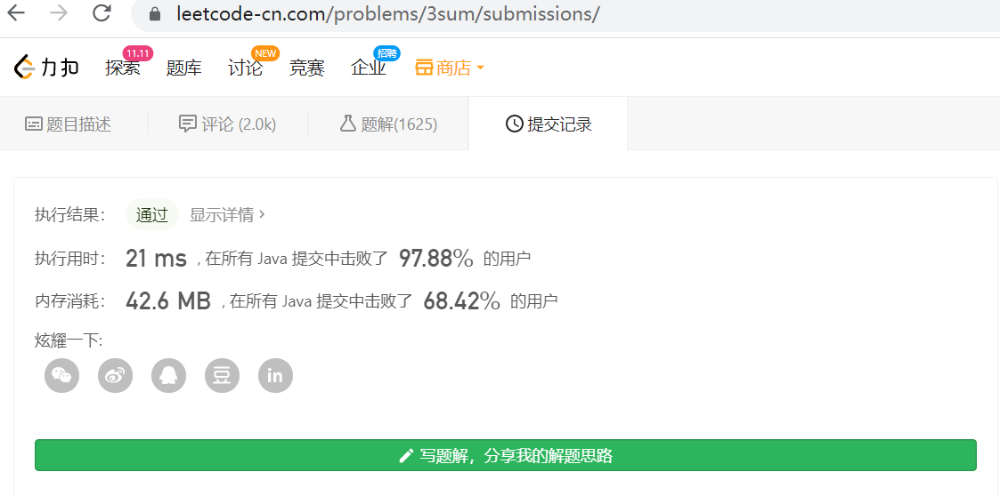

【15.三数之和】【Java】.md

[15.三数之和](https://leetcode-cn.com/problems/3sum)
**-----------**

Two Sum 系列问题在 LeetCode 上有好几道，这篇文章就挑出有代表性的几道，介绍一下这种问题怎么解决。

### ThreeSum
给你一个包含 n 个整数的数组 nums，判断 nums 中是否存在三个元素 a，b，c ，使得 a + b + c = 0 ？请你找出所有满足条件且不重复的三元组。

注意：答案中不可以包含重复的三元组。

这个问题的**最基本形式**是这样：给你一个数组和一个整数 `target`，可以保证数组中**存在**3个数的和为 `target`，请你返回满足条件的3个数集合。

比如输入 `nums = [-1, 0, 1, 2, -1, -4], target = 0`，算法应该返回数组 ` [-1, 0, 1],[-1, -1, 2]`

这个问题如何解决呢？首先最简单粗暴的办法当然是穷举：

```java
public List<List<Integer>> threeSum2(int[] nums) {
        List<List<Integer>> lists = new LinkedList<List<Integer>>();
        for (int i = 0; i < nums.length - 1; i++) {
            for (int j = i + 1; j < nums.length - 2; j++) {
                for (int k = j + 1; k < nums.length; k++) {
                    if (nums[i] + nums[j] + nums[k] == 0){
                        lists.add(new ArrayList<>(Arrays.asList(nums[i], nums[j], nums[k])));
                    }
                }
            }
        }
        return lists;
    }
```

这个解法非常直接，时间复杂度 O(N^3)，空间复杂度 O(1)，Leetcode提交直接超时，因为时间复杂度太高了。

可以通过一个外层循环，加上2个双向指针，减少时间复杂度：

```java
public List<List<Integer>> threeSum1(int[] nums) {
        List<List<Integer>> lists = new LinkedList<List<Integer>>();
        if (nums == null || nums.length < 3){
            return lists;
        }
        //时间复杂度O(logn)
        Arrays.sort(nums);
        int sum = 0;
        int left = 0;
        int right = 0;
        int target = 0;
        for (int i = 0; i < nums.length - 2; i++) {
            //假如循环到num[i]已经大于0，因为已经排过序，说明已经后面的没有满足条件的，可以直接返回
            if (nums[i] > 0 || nums[i] + nums[i + 1] > 0){
                return lists;
            }
            //去掉重复的循环，数据只走一遍
            if (i > 0 && nums[i] == nums[i - 1]){
                continue;
            }
            //为了方便和后面两个数的和做比较
            target = -1 * nums[i];
            //使用双向指针减少边界的循环
            left = i + 1;
            right = nums.length - 1;
            while (left < right){
                //使用变量保存，防止重复计算
                sum = nums[left] + nums[right];
                if (sum == target){
                    //由于排过序，所以可以直接添加不用考虑重复的情况
                    lists.add(Arrays.asList(nums[i], nums[left], nums[right]));
                    //left++和right--是因为现在的数刚好，left右侧的数肯定是大于等于left，right左侧是小于等于right
                    left++;
                    right--;
                    while (left < right && nums[left] == nums[left - 1]){
                        left++;
                    }
                    while (left < right && nums[right] == nums[right + 1]){
                        right--;
                    }
                }else if (sum > target){
                    right--;
                }else{
                    left++;
                }
            }
        }
        return lists;
    }
```

这样，由于外层的查询时间为 O(N) * while循环可以认为也是O(N)，所有算法的复杂度降低到 O(N^2)，由于只是引入了左右指针，所以空间复杂度可以认为还是O(1)。不过综合来看，是要比暴力解法高效的。

附上leetcode的执行结果
